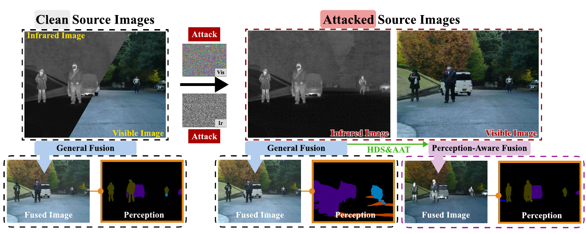
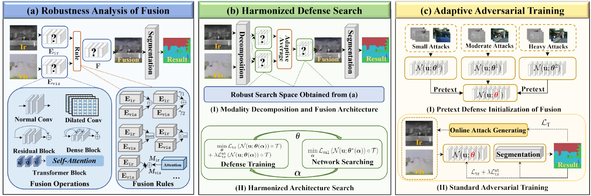
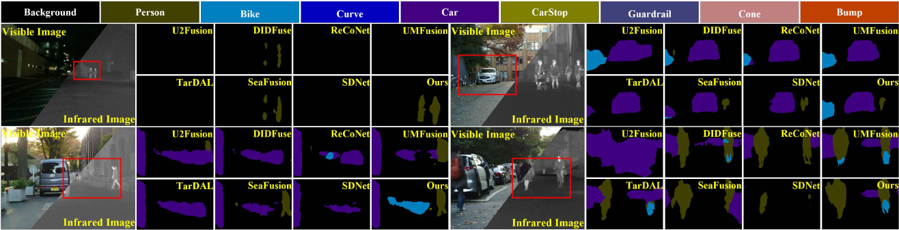
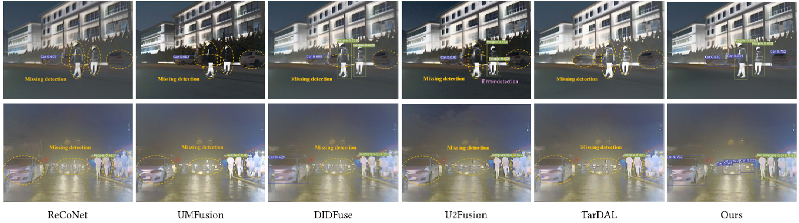

# PAIF
 Codes of PAIF:  Perception-Aware   Infrared-Visible Image Fusion for Attack-Tolerant  Semantic Segmentation


Zhu Liu,
Jinyuan Liu,
Benzhuang Zhang,
Long Ma,
Xin Fan,
Risheng Liu. 
In ACM MM 2023. 
[Paper](https://arxiv.org/pdf/2308.03979.pdf)

## Abstract
Infrared and visible image fusion is a powerful technique that combines complementary information from different modalities for downstream semantic perception tasks. Existing learning-based   methods show remarkable performance, but are suffering from the inherent vulnerability of adversarial attacks, causing a significant decrease in accuracy. In this work, a perception-aware fusion framework is proposed to promote segmentation robustness in adversarial scenes. 
We first conduct systematic analyses about the components of image fusion, investigating the correlation with segmentation robustness under adversarial perturbations. Based on these analyses, we propose a harmonized architecture search with a decomposition-based structure to balance standard accuracy and robustness. We also propose an adaptive learning strategy to improve the parameter robustness of image fusion, which can learn effective feature extraction under diverse adversarial perturbations. Thus, the goals of image fusion (i.e., extracting complementary features from source modalities and defending attack) can be realized from the perspectives of architectural and learning strategies.
Extensive experimental results demonstrate that our scheme substantially enhances the robustness, with gains of 15.3\% mIOU of segmentation in the adversarial scene, compared with  advanced competitors.

## Fusion Reuslts and Chinese Version

The source images and fused results on TNO, RoadScene  M3FD (600 images), and MFNet are
provided in [link](https://drive.google.com/drive/folders/1gSLTvycetEVQAAa50_2aOHQqfswoQ0zD)

中文版介绍提供在此链接 [link](https://arxiv.org/pdf/2308.03979.pdf)


Welcome all comparision and disscussion!
If you have any questions, please sending an email to "liuzhu_ssdut@foxmail.com"


## Requirements
+ Python 3.7
+ PyTorch 1.10.1
+ Checkpoint of fusion+segmentation (w/o AAT)
[Checkpoint](https://drive.google.com/file/d/1f_hrb0oRuFxaUrO6qFxKBGkG5KVs9S9M/view?usp=sharing)
+ Checkpoint of fusion+segmentation (w/ AAT)
[Checkpoint](https://drive.google.com/file/d/1DdajTy_msuxN8rEVc02HJd7VPJhjKgbS/view?usp=sharing)
## Usage
### Data preparation
Please download MFNet dataset to validate these models.
### Testing
Run "**python test_orignal.py**" to test the model (w/o AAT).
Run "**python robust_test.py**" to test the model (w/ AAT).


### Training
The search and training codes will be updated soon.
### Workflow
 

 

### Results of segmentation
 

### Results of Detection
 


## Citation
If you use this code for your research, please cite our paper.

```
@article{liu2023paif,
  title={PAIF:  Perception-Aware   Infrared-Visible Image Fusion for Attack-Tolerant  Semantic Segmentation},
  author={Zhu Liu and Jinyuan Liu and Benzhuang Zhang and Long Ma and Xin Fan and Risheng Liu},
  journal={ACM MM},
  year={2023},
}
```


